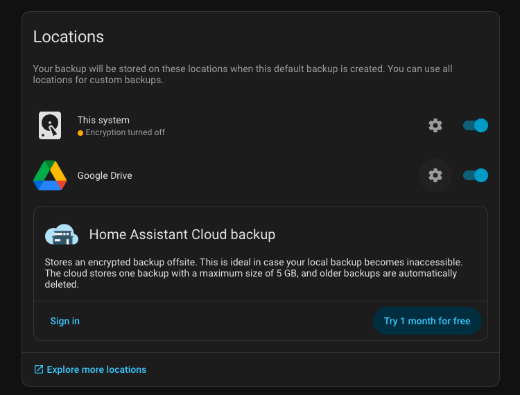

# Configure Home Assistant

Steps copied from https://pimylifeup.com/home-assistant-docker-compose

## Docker-compose.yaml

In the folder where HA will sit, create the following docker-compose.yaml file

```
services:
  homeassistant:
    container_name: homeassistant
    image: "ghcr.io/home-assistant/home-assistant:stable"
    volumes:
      - ./CONFIG_FOLDER:/config
      - /etc/localtime:/etc/localtime:ro
      - /run/dbus:/run/dbus:ro
    restart: unless-stopped
    privileged: true
    network_mode: host
    environment:
      TZ: Europe/Lisbon
```

Then, run

> docker compose up -d

## Back up to Google Drive

Access HA page https://www.home-assistant.io/integrations/google_drive/

In the Google Dashboard when asked to, there are a few steps to do:
- Create a project
- In the Audience, publish to production
- Create credentials 
- Enable Google Drive api - https://console.cloud.google.com/apis/library/drive.googleapis.com?


Enable the back up Google Drive in the HomeAssistant backup page http://raspberrypi.local:8123/config/backup/settings

